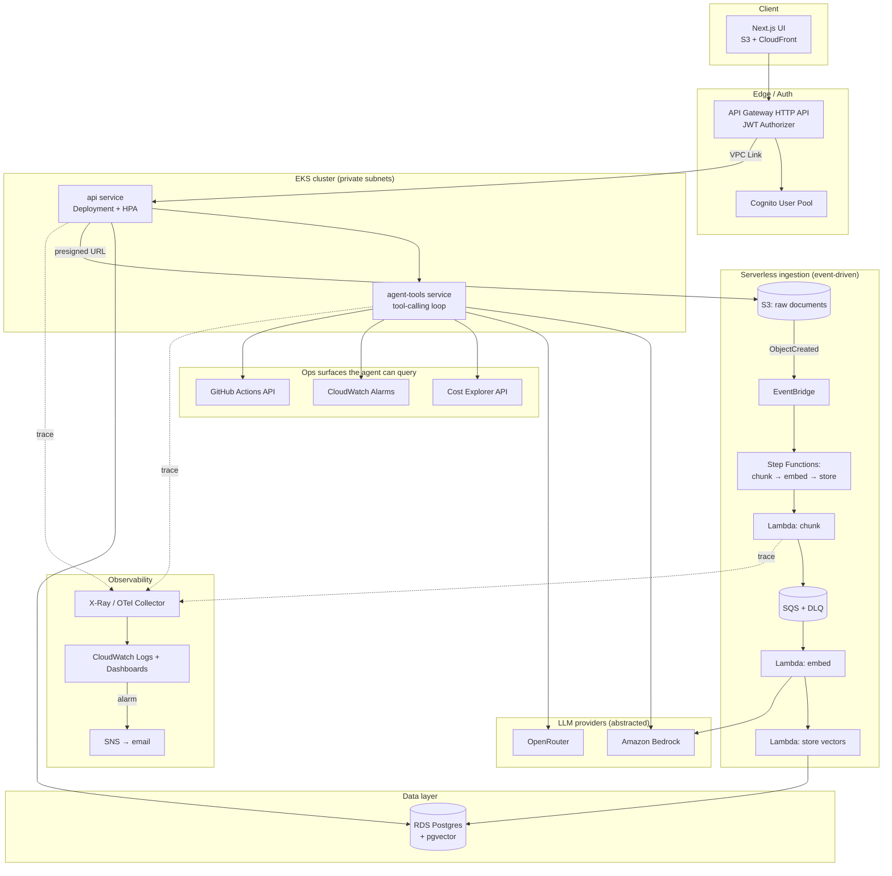

# Architecture

## System diagram

## Why hybrid (serverless + EKS), not one or the other

Your day job is serverless-first, so the ingestion pipeline stays serverless deliberately — it's a refresher, not new ground, and event-driven ingestion (S3 event → EventBridge → Step Functions → SQS → Lambda, with a DLQ and idempotent handlers) is genuinely the right shape for bursty, asynchronous work regardless of what you're used to.

The API and agent layer run on EKS on purpose, because that's the gap: real Kubernetes-on-AWS reps — IRSA instead of instance profiles, HPA instead of Lambda concurrency, network policies instead of Lambda's implicit isolation, a Deployment's rollout behavior instead of Lambda's built-in versioning. Running a synchronous, stateful-ish, always-warm chat/agent workload on EKS also happens to be the more realistic choice for that workload shape — Lambda cold starts are a bad fit for an interactive agent loop that may call multiple tools in sequence.

## Why two IaC tools

Terraform owns the platform layer: VPC, EKS cluster, ECR, IAM permission boundaries, AWS Budgets. This layer changes rarely, benefits from Terraform's broad provider ecosystem and state-locking maturity, and mirrors how a platform/infra team usually owns this in a real org.

CDK (TypeScript) owns application infra: S3, CloudFront, API Gateway, Lambda, Step Functions, Cognito. This layer changes often as the app evolves, benefits from being in the same language as the app code (shared types, faster iteration), and mirrors how a product team usually owns this.

The seam between them (e.g., the API service needs the VPC ID and EKS OIDC provider ARN that Terraform created) is deliberately instructive — see ADR-0003 for how cross-stack references are passed (SSM Parameter Store, not hardcoded values).

## Why RDS + pgvector, not OpenSearch or a managed vector DB

See `docs/adrs/0002-vector-store-choice.md`. Short version: OpenSearch Serverless has no meaningful free tier and a non-trivial cost floor; a `db.t3.micro` Postgres instance is inside the 12-month free tier, and pgvector is a real, production-used pattern (not a toy), so this teaches a transferable skill (RDS, VPC security groups, IAM DB auth) instead of a throwaway one.

## Why an LLM provider abstraction

The agent/RAG code calls an internal `LlmProvider` interface, not the Bedrock or OpenRouter SDKs directly. Bedrock is the AWS-native default (and requires you to go through the real "request model access" workflow — a genuine AWS onboarding step worth having done). OpenRouter is wired in as a documented, swappable alternative — useful if Bedrock model access/quotas are ever a blocker, and it's a legitimate architecture pattern (ports & adapters) worth being able to explain and defend, not just decoration.

## Networking & security summary

- VPC with public subnets (ALB/NAT) and private subnets (EKS nodes, RDS). See ADR-0001 on NAT Gateway vs VPC endpoints for the cost trade-off.
- EKS nodes and the RDS instance have no public IPs. Only the ALB and CloudFront are internet-facing.
- IRSA: pods get scoped IAM roles via OIDC federation — no long-lived AWS credentials on nodes or in pods.
- API Gateway JWT authorizer validates Cognito tokens before any request reaches the VPC.
- Secrets (OpenRouter API key, any non-IAM credentials) live in Secrets Manager, referenced at runtime — never in env vars committed to the repo, never in CDK/Terraform source.
- WAF in front of CloudFront and API Gateway (rate limiting, managed rule groups) — see Epic 8.
- All data encrypted at rest (KMS) and in transit (TLS everywhere, including pod-to-pod where practical).

## Observability

Every request gets a trace ID at the edge (API Gateway) and it propagates through: API Gateway → EKS `api` service → EKS `agent-tools` service → (async) SQS → Lambda → RDS. X-Ray (or an OpenTelemetry Collector running as a DaemonSet on EKS, exporting to X-Ray — see Epic 8 for which you pick and why) stitches these into one trace so "show me what happened to this one request" is answerable in under a minute, not by grepping five log groups.

## What would change at real scale

Documented properly at the end of the build (Epic 9) as `docs/SCALING.md` — this is one of the strongest interview artifacts in the whole repo: a concrete, specific answer to "how would this break at 100x traffic and what would you change first," written about a system you actually built rather than recited in the abstract.
